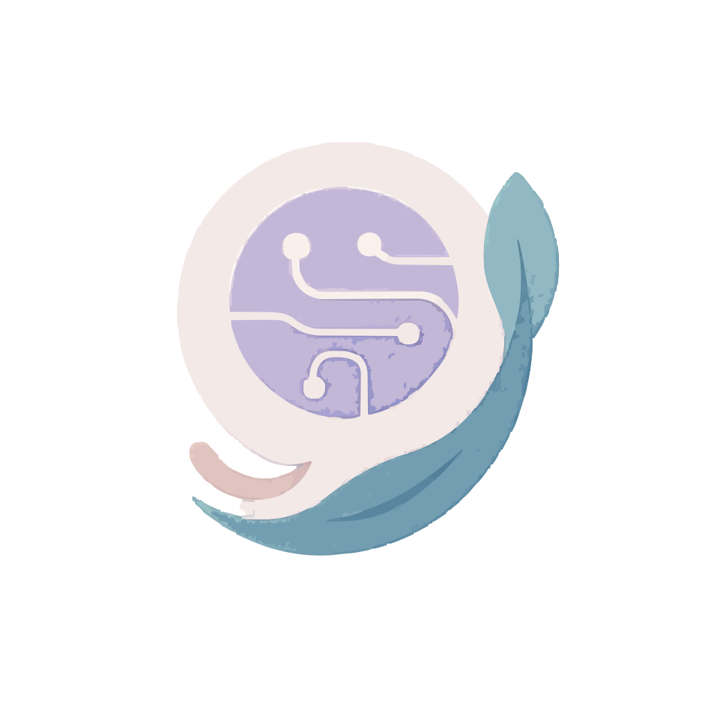

# AI Companion

AI Companion is a full-stack wellness application that combines journaling, mood tracking, and AI-powered conversations to support users' mental health and personal growth.



## Features

- **3D Avatar Interface**: Interact with an engaging 3D avatar for a more personal experience
- **Wellness Tracking**: Monitor your mood patterns and emotional well-being
- **Smart Journaling**: Document your thoughts with AI-assisted insights
- **Chat Support**: Have meaningful conversations with an AI companion
- **Data Privacy**: Your personal information stays secure with Firebase authentication

## Tech Stack

### Frontend
- React 19 with Vite for fast development
- Tailwind CSS for responsive design
- React Three Fiber for 3D avatar rendering
- Framer Motion for smooth animations
- Firebase authentication

### Backend
- Node.js server
- Ollama integration for AI model inference
- RESTful API architecture

## Getting Started

### Prerequisites
- Node.js 18+ 
- npm or yarn
- Ollama installed locally (for development)

### Installation

1. Clone the repository:
```bash
git clone https://github.com/yourusername/ai-companion.git
cd ai-companion
```

2. Install dependencies:
```bash
npm install
```

3. Set up environment variables:
```bash
cp .env.example .env
# Edit .env with your configuration
```

### Running the Application

Start both frontend and backend:
```bash
npm run dev
```

Or run them separately:
```bash
npm run dev:frontend
npm run dev:backend
```

## Project Structure

```
/
├── frontend/          # React application
│   ├── src/           # Source code
│   │   ├── components/  # Reusable UI components
│   │   ├── contexts/    # React contexts for state management
│   │   ├── pages/       # Application pages
│   │   └── services/    # API services
│   └── public/        # Static assets
└── backend/           # Node.js server
    ├── routes/        # API endpoints
    ├── config/        # Server configuration
    └── utils/         # Helper functions
```

## License

This project is licensed under the MIT License - see the LICENSE file for details.

## Acknowledgements

- Ollama for providing the AI models
- React Three Fiber community for 3D rendering resources
- The open source community for the many libraries that make this project possible
