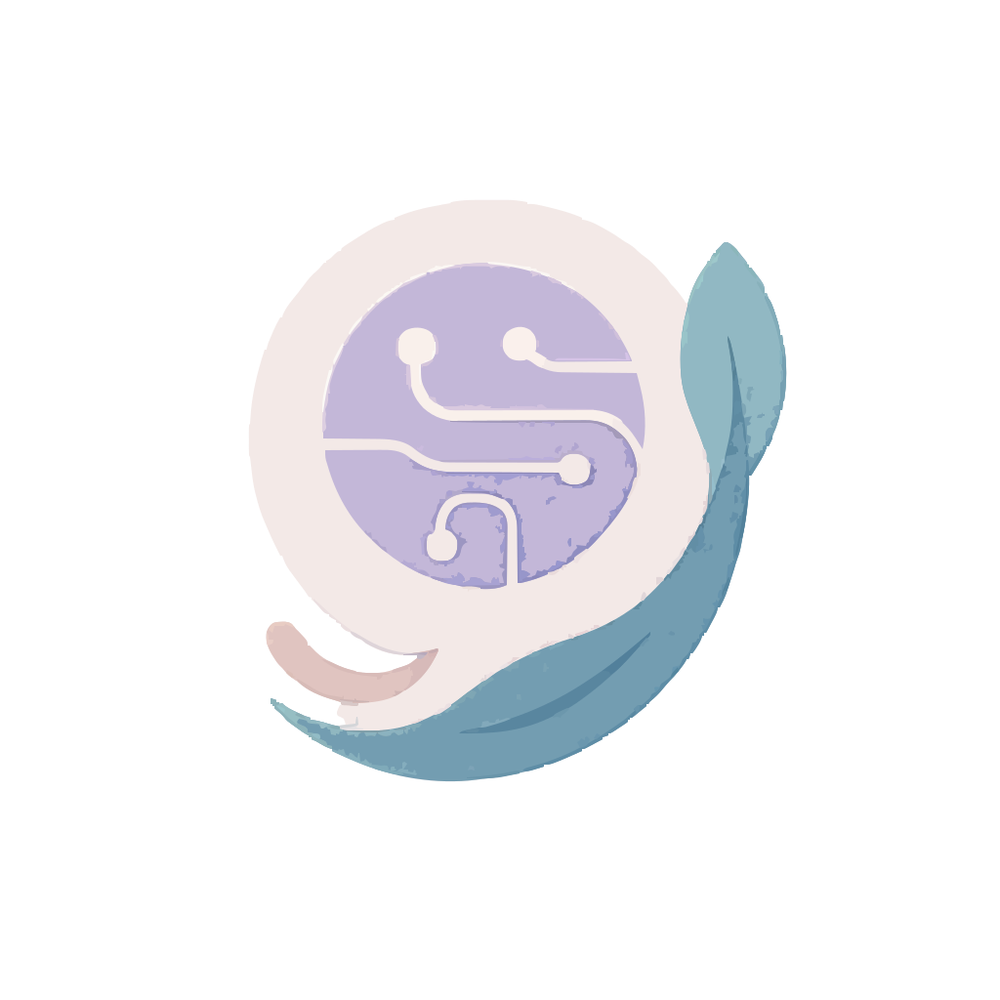

# Seriva - Your AI Companion for Mental Wellness



Seriva is your personal AI companion designed to support your mental wellness journey through meaningful conversations and self-reflection. Whether you need someone to talk to, want to track your mood, or just need a space to organize your thoughts, Seriva is here for you.

## ✨ Key Features

### 🤖 Intelligent Conversations
- Engage in natural, flowing conversations with an AI that understands and responds to your emotions
- Multiple conversation styles to match your needs - from empathetic to creative
- Context-aware responses that remember your previous interactions

### 📔 Smart Journaling
- Beautiful, distraction-free writing experience
- AI-powered insights and reflections on your entries
- Mood tracking with visual analytics
- Tag and organize your thoughts for easy reference

### 🌟 Personal Growth
- Daily check-ins to help build positive habits
- Personalized suggestions based on your mood and journal entries
- Progress tracking and achievements

### 🔒 Your Privacy Matters
- End-to-end encryption for all your conversations and journal entries
- Full control over your data
- No ads, no data selling - your thoughts stay private

## 🚀 Getting Started with Seriva

1. **Create Your Account**
   - Sign up with email or social login
   - Set up your profile and preferences

2. **Start a Conversation**
   - Chat with Seriva about anything on your mind
   - Try different conversation styles to find your perfect match

3. **Begin Journaling**
   - Write freely or use guided prompts
   - Track your mood over time
   - Review your personal insights

## 📱 Available On
- Web (Chrome, Firefox, Safari, Edge)
- Mobile Web (iOS & Android)
- Native mobile apps coming soon!

## 💡 Why Choose Seriva?

- **Always Available**: 24/7 support whenever you need it
- **Non-judgmental Space**: Share freely without fear of judgment
- **Personalized Experience**: Adapts to your communication style and needs
- **Science-Backed**: Built using evidence-based therapeutic techniques

## 📞 Need Help?
Visit our [Help Center](https://help.seriva.app) or email support@seriva.app

---
*Seriva is not a substitute for professional mental health care. If you're in crisis, please contact emergency services or a licensed mental health professional in your area.*

### Running the Application

Start both frontend and backend:
```bash
npm run dev
```

Or run them separately:
```bash
npm run dev:frontend
npm run dev:backend
```

## Project Structure

```
/
├── frontend/          # React application
│   ├── src/           # Source code
│   │   ├── components/  # Reusable UI components
│   │   ├── contexts/    # React contexts for state management
│   │   ├── pages/       # Application pages
│   │   └── services/    # API services
│   └── public/        # Static assets
└── backend/           # Node.js server
    ├── routes/        # API endpoints
    ├── config/        # Server configuration
    └── utils/         # Helper functions
```

## License

This project is licensed under the MIT License - see the LICENSE file for details.

## Acknowledgements

- Ollama for providing the AI models
- React Three Fiber community for 3D rendering resources
- The open source community for the many libraries that make this project possible
